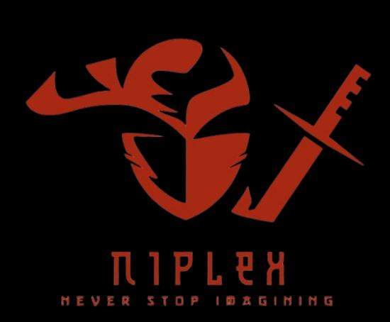

<div align="center">

<!-- Upload your logo as assets/niplex-logo.png (black bg version recommended) -->


<br/>


<br/>

```bash
> boot sequence initiated .......... [ OK ]
> loading  niplex.agents ........... [ OK ]
> mounting  harness + mcp .......... [ OK ]
> signal locked :: AJ-NIPLEX ....... [ LIVE ]
```

[](https://www.python.org/)
[](https://modelcontextprotocol.io/)
[](https://discordpy.readthedocs.io/)
[](https://www.linux.org/)

</div>

---

### Main Products

#### 1. NiPlex-Harness (Public)
**Personal AI agent harness** controlled from Discord or Telegram.  
Built for people on free hosts (HidenCloud etc.) without a PC — **phone is the control panel**.

- Discord (recommended) or Telegram gateway  
- `/setup` → provider → API key → models from API  
- Built-in Python sandbox + **approval buttons**  
- Memory, files, skills, web search, terminal  
- Allow-list only

**Repo:** [NiPlex-Harness](https://github.com/Aj-Niplex/NiPlex-Harness)

#### 2. NiPlex-MCP (Private · Core)
**Production Model Context Protocol server** — one AI agent’s full toolkit behind a single MCP connection.

- 47+ tools  
- GitHub (full repo / file / branch / issue / PR access)  
- Sandboxes (Daytona / E2B / Horizon)  
- HidenCloud (live production server)  
- Web search + YouTube  
- Neural memory sub-agent  
- Google Workspace (Gmail draft, Calendar, Drive, Docs)

Security-reviewed · allow-list dispatch · no email-send · no auto-merge.

---

### Architecture (simple)

```text
Discord / Telegram  ──►  NiPlex-Harness  ──►  Sandbox + Approvals
                              │
                              ▼
                         NiPlex-MCP (47+ tools)
                              │
          ┌───────────────────┼───────────────────┐
          ▼                   ▼                   ▼
       GitHub            Sandboxes            Neural
     (full access)     (Daytona/E2B)        (memory)
          │                                       │
          └───────────────────┬───────────────────┘
                              ▼
                    Durable Knowledge Store
```

---

### Other Public Work

| Project | What it is |
|---------|------------|
| **[Rei-kun-Bot](https://github.com/Aj-Niplex/Rei-kun-Bot)** | Live Discord AI orchestrator — multi-model, persistent persona, resource hub |
| **[Aj-Niplex.github.io](https://aj-niplex.github.io/)** | Public portfolio site |

<p align="center">
  <a href="https://github.com/Aj-Niplex/NiPlex-Harness">
    
  </a>
  <a href="https://github.com/Aj-Niplex/Rei-kun-Bot">
    
  </a>
</p>

---

### Tools & AI Agents I use

| Role | Tool |
|------|------|
| **Main developer** | Claude |
| **Bug hunter & secondary dev** | Grok |
| **3rd / random tasks** | Mistral Vibe |
| **Research (sometimes)** | ChatGPT |
| **Custom agent (sometimes)** | My own customized Hermes |
| **Google-connected work** | Gemini |

### AI Providers I love & use

- **Gemini** (Google APIs)
- **Agnes AI** by Sepians

---

### Stack

```text
Python 3.13 · MCP Protocol · Discord.py · aiohttp
Linux VPS · Sandbox isolation · Agent memory layers
Mobile-first · Backend & agents first
```


---

### How I work

- Backend & agents first  
- Ship real running systems, then improve them  
- Social apps (Discord / Telegram) as the primary UI  
- Transparent prompts, bounded context, explicit approvals  
- Mobile-first whenever possible

---

### GitHub Stats (auto-updating)

<div align="center">


<br/>


<br/>


<br/>


</div>

---

<div align="center">

**Never Stop Imagining.**

[Portfolio](https://aj-niplex.github.io/) · [NiPlex-Harness](https://github.com/Aj-Niplex/NiPlex-Harness) · [GitHub](https://github.com/Aj-Niplex)

</div>
